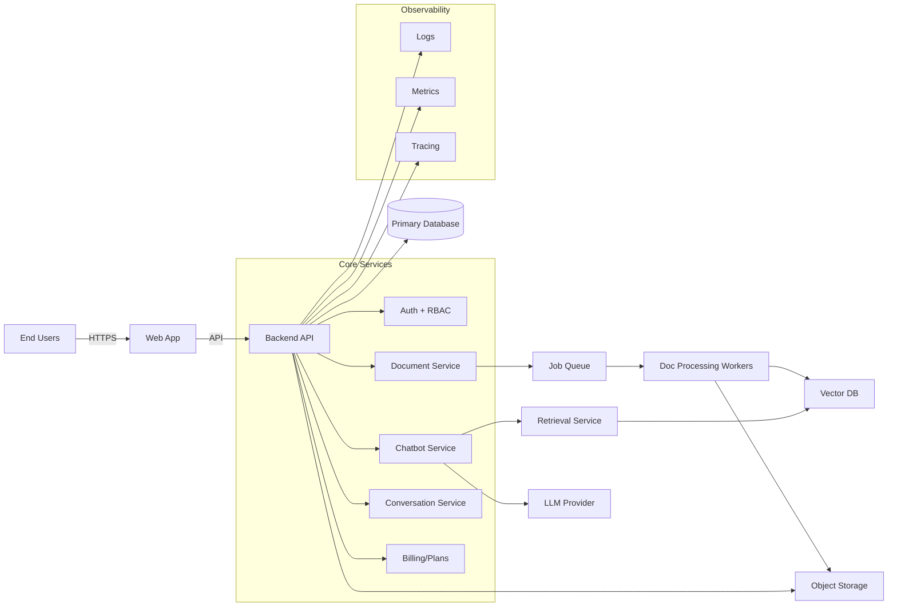
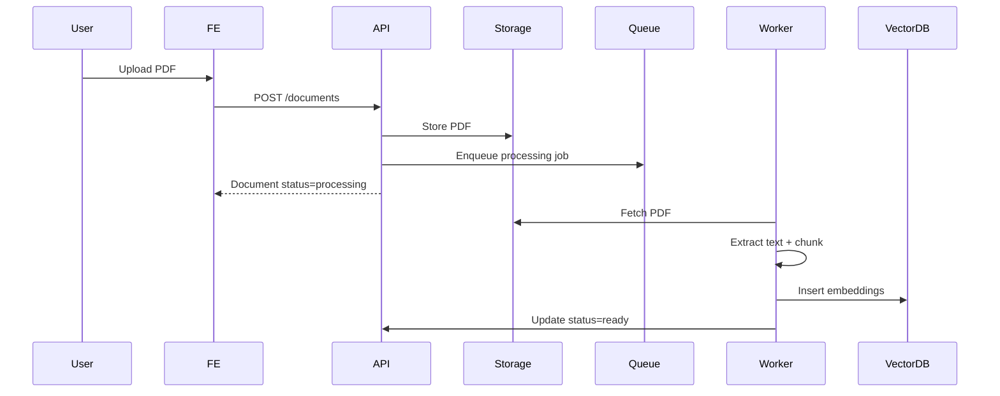
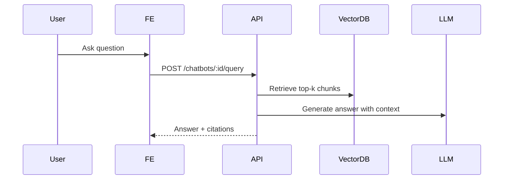
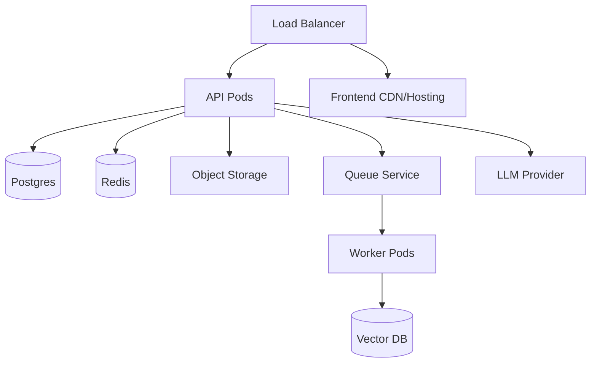

# DocuChat System Architecture (v1)

**Version:** 1.0  
**Date:** 2026-02-15  
**Status:** Draft → Committed

---

## 1. Overview
DocuChat is a multi-tenant B2B SaaS platform that allows organizations to upload private PDFs and create custom chatbots that answer questions using Retrieval-Augmented Generation (RAG). The architecture prioritizes tenant isolation, secure document handling, fast query latency, and modular extensibility.

### Key Goals
- **Multi-tenant isolation** at app + data layers
- **Scalable ingestion** for PDFs
- **Low-latency Q&A** via RAG
- **Secure by default** (TLS, encrypted storage, RBAC)
- **Extensible** for future document types and integrations

---

## 2. High-Level System Diagram

---

## 3. Core Components

### 3.1 Web Application (Frontend)
- Single-page app for authentication, document management, chatbot management, and chat UI
- Communicates with backend via HTTPS REST/JSON

### 3.2 Backend API
- Monolith or modular service (v1 recommended as modular monolith)
- Responsibilities:
  - Auth, session management, email verification
  - Tenant isolation & RBAC enforcement
  - Document CRUD and upload orchestration
  - Chatbot CRUD and configuration
  - Conversation / message persistence
  - Usage limits & plan enforcement

### 3.3 Document Service
- Handles PDF upload, metadata, and storage pointers
- Enqueues processing jobs and exposes document status

### 3.4 Document Processing Workers
- Asynchronous pipeline:
  1. PDF text extraction
  2. Chunking
  3. Embedding generation
  4. Indexing into vector database
- Designed to scale horizontally

### 3.5 Retrieval & RAG Service
- For each question:
  - Retrieves top-k relevant chunks by embeddings
  - Builds prompt with system + user + context
  - Calls LLM provider
  - Returns answer with citations

### 3.6 Data Stores
- **Primary DB (PostgreSQL)**: tenants, users, documents, chatbots, conversations, messages, billing metadata
- **Object Storage (S3/GCS/Azure Blob)**: PDF files and derived assets
- **Vector DB (Pinecone/Weaviate/pgvector)**: embeddings and chunk metadata

---

## 4. Key Data Flows

### 4.1 Upload & Ingestion

### 4.2 Q&A / Chat

---

## 5. Data Model Highlights
- **Tenants**: logical isolation boundary
- **Users**: belong to a single tenant (v1)
- **Documents**: stored with status (uploading/processing/ready/error)
- **Chatbots**: configured with system prompt and linked documents
- **Conversation & Messages**: stored with citations JSON

---

## 6. Security & Compliance
- TLS 1.2+ for all traffic
- Password hashing via bcrypt/argon2
- Secure, HTTP-only session cookies
- Tenant- and role-based authorization checks on every request
- Data-at-rest encryption for PDFs and DB volumes
- Optional per-tenant encryption keys (future)
- Audit logging for sensitive actions

---

## 7. Scalability & Performance
- **Horizontal scaling**: API layer and workers
- **Async pipeline**: ingestion off the request path
- **Caching**: frequently requested bot configs, embeddings cache
- **Latency target**: <5s for 95% of queries

---

## 8. Observability
- Structured logs (JSON)
- Metrics: request latency, queue depth, embedding time, LLM latency
- Distributed tracing (API → workers → vector DB → LLM)
- Error tracking (Sentry or equivalent)

---

## 9. Deployment Topology

---

## 10. Technology Choices (Recommended)
- **Frontend:** React + TypeScript
- **Backend:** Node.js (NestJS/Express) or Python (FastAPI)
- **Queue:** Redis + BullMQ or AWS SQS
- **Vector DB:** pgvector (self-hosted) or managed service
- **LLM Provider:** OpenAI / Anthropic / Azure OpenAI
- **Infra:** Docker + Kubernetes or container-based PaaS

---

## 11. Risks & Mitigations
- **LLM latency/cost** → caching, batching, monitoring
- **Embedding quality** → model evaluation + retriever tuning
- **Ingestion bottlenecks** → async workers + autoscaling
- **Hallucinations** → strict system prompt + citations + answer refusal

---

## 12. Future Extensions
- Multi-document types (DOCX, HTML, TXT)
- External integrations (Slack/Teams)
- Fine-grained RBAC
- Advanced analytics dashboard
- Tenant-level API keys and public API

---

## 13. Traceability to SRS
- Meets core functional requirements FR-1..FR-15
- Addresses NFR-1..NFR-10 via scaling, async processing, encryption, and monitoring
